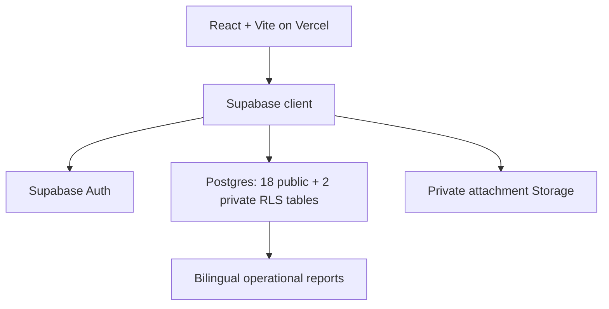
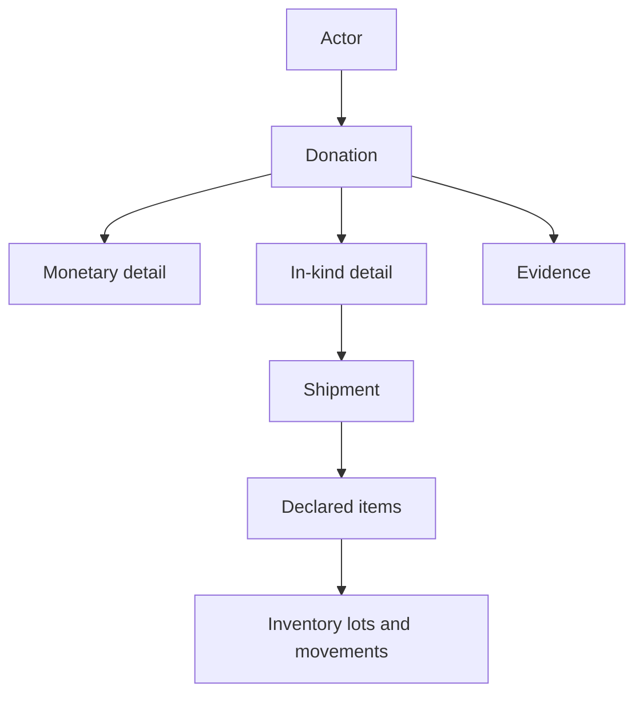

# System Architecture

## Product surface

Edifica Digital combines a public bilingual landing page with an authenticated operational application for donation traceability.

| Surface | Purpose | Current state |
|---|---|---|
| `/` | Present the proposal, methodology, and international reporting capability | Bilingual landing experience |
| `/donations/in-kind/new` | Register containers and other in-kind shipments | Bilingual mobile-first workflow with local draft |
| `/donations/monetary/new` | Register cash, transfers, foreign currency, and other monetary receipts | Bilingual continuous workflow with local draft and private evidence |
| Receive, Transform, Impact | Record the complete operational cycle | Database foundation deployed; interface integration proceeds by module |
| Reports and dashboard | Summarize resources, operations, and impact | Reporting model defined; application views proceed by module |

The product name shown on the primary page and production domain is `somosedificadigital`.

## Runtime architecture



Production publishes from `main` to `edificadigital.vercel.app` and `somosedificadigital.com`. Pull-request review is the release gate.

The connected Supabase project is `edifydb` (`rrqyihsjftlloizsccvi`). Database identifiers use English `snake_case`; the interface and reporting layers provide Spanish and English.

### Domain, DNS, and email

- DNS for `somosedificadigital.com` is managed on Cloudflare (`brett.ns.cloudflare.com`, `selah.ns.cloudflare.com`). The site (Vercel) and mail (Zoho) records stay DNS-only; Cloudflare's orange-cloud proxy is not enabled for either, since Vercel manages its own TLS/edge for the site and MX/TXT records cannot be proxied regardless.
- Mail is hosted on Zoho Mail (`mx.zoho.com`, `mx2.zoho.com`, `mx3.zoho.com`), with SPF, DKIM, and DMARC (`p=none`, monitor mode) published for the domain.
- Supabase Auth sends transactional email (magic links) through Zoho's SMTP relay via custom SMTP (`Authentication > Emails > SMTP Settings`), using `contacto@somosedificadigital.com` as the sender. This replaces Supabase's rate-limited built-in relay (2 emails/hour) with Zoho's higher send limit.

## Operational flow

### Receive



Donations accept monetary, in-kind, and mixed headers. Each detail line records one resource type. Reference valuation for donated goods remains separate from cash received.

A monetary line preserves origin amount and currency in `donation_detail`. Its one-to-one `monetary_donation_detail` extension records receipt method, USD reporting base, applied exchange rate, rate source and date, transaction references, and reconciliation audit data. USD cash uses an identity rate of 1. Foreign-currency receipts retain the source values and evidence used for conversion.

For a shipment or container, the application records the donor, origin, route, transport reference, estimated arrival, declared items, dietary and expiry information, physical receipt, accepted or damaged quantities, inventory movements, and supporting evidence.

### Transform

One `kit_transformation` represents one kit type and the quantity prepared. Evidence belongs to the transformation record. Inventory consumption is represented by negative `transformation` movements in the lot ledger.

### Impact

An `impact_event` records its responsible actor, dates, target population, operational status, aggregate demographics, delivered kit quantities, and evidence. Minimum nominal beneficiary identity and event participation are stored separately in the private schema. Public and international reporting uses aggregate impact data and non-identifying references.

## Budget, donations, and international reporting

The reporting architecture preserves four separate measures:

| Measure | Meaning |
|---|---|
| Cash received | Monetary donation details |
| In-kind reference value | Evidence-backed estimate of donated goods |
| Approved budget | Spending authority defined by the approved budget module |
| Operating expenses | Logistics, customs, handling, warehousing, procurement, and related execution |

International organizations may request bilingual reports built from these measures, shipment evidence, inventory movements, transformations, distribution events, and aggregate impact. Currency, valuation method, valuation source, valuation date, and evidence references must remain available for audit.

The budget module requires a dedicated schema and migration. Operational donation and shipment records remain independent from budget records.

## Interaction principles

- Spanish and English cover every visible label, instruction, validation message, status, and report heading.
- A persistent language switch keeps the user on the same task and preserves entered values.
- Workflows use short steps, visible progress, familiar field names, and one primary action per step.
- Required information is stated in words, and errors identify the action that enables progress.
- Touch targets are at least 44 × 44 px, labels stay visible, keyboard focus is clear, and reduced-motion preferences are honored.
- Product and marketing copy uses direct statements. It avoids antitheses, comparisons, personification of non-human subjects, and decorative patterns associated with generic AI-generated pages. The word “no” is replaced with a direct construction when meaning remains precise.
- The established type, color, spacing, and component language remains the visual source of truth.

## Security and data access

- Supabase Auth supplies authenticated sessions. Magic-link sign-in is the current planned entry method.
- All 18 public operational tables and both private beneficiary tables use RLS backed by a private active-operator allow-list.
- Anonymous table access is revoked.
- Attachments live in a private bucket with file-size and MIME restrictions.
- Beneficiary identity and contact data stay in the private schema and are absent from public reporting endpoints.
- The balance view uses security-invoker behavior.
- Granular permissions by organization and role remain a subsequent milestone.
- Service-role keys and database secrets stay outside client code and source control.

## Observability

Uncaught client errors, unhandled promise rejections, React render errors, and failed in-kind donation submissions are reported from the browser to a small Vercel Serverless Function (`frontend/api/log.js`), which logs a sanitized, size-capped JSON line. Those lines appear directly in Vercel's built-in Runtime Logs — no log drain, third-party service, or extra cost is required. Reporting never blocks the UI and never includes donor data, only error messages, stack traces, and the originating URL. See `docs/plans/SPRINT-S1-v1_vercel-observability.md`.

## Current integration boundary

The in-kind interface now provides magic-link access, validates operator authorization, preserves a browser draft, uploads private evidence to deterministic paths, and persists the announcement through the idempotent `submit_in_kind_shipment` RPC. One RPC transaction creates or reuses the sender actor, donor role, donation, details, shipment, declared items, and evidence metadata.

The monetary interface uses the same operator gate, deterministic private uploads, and retry-safe submission key. The security-invoker `submit_monetary_donation` RPC creates or reuses the donor, monetary donation, origin detail, multi-currency extension, and evidence metadata in one transaction.

The protected beneficiary foundation is available through the security-invoker `register_beneficiary` RPC. It requires privacy acknowledgement, returns a non-identifying `BEN-…` code, and can link participation to an impact event. A dedicated beneficiary interface remains a subsequent module; direct public access to nominal rows is outside the product boundary.

Inventory lots and movements begin after physical receipt. This boundary preserves declared quantities until a team member records warehouse, accepted, damaged, condition, and verification data from inspection.

## Repository map

```text
frontend/                 React + Vite application
supabase/migrations/      Ordered, immutable database changes
supabase/tests/           pgTAP behavior and safeguard specifications
docs/adr/                 Architecture decisions
docs/plans/               TDD plans and delivery status
docs/specs/               Executable behavior descriptions
```

## Release model

1. Create a branch from `main`.
2. Document the plan and flag database changes.
3. Commit failing tests.
4. Implement the smallest passing change and refactor under test coverage.
5. Validate tests, lint, build, schema, RLS, and relevant Supabase advisors.
6. Open a pull request for human review.
7. Merge to `main` to publish both production domains.

See `docs/adr/ADR-001-manual-production-promotion.md` for the production-domain history, `docs/adr/ADR-003-in-kind-shipment-inventory.md` for the shipment model, and `docs/adr/ADR-004-protected-beneficiary-identity.md` for the beneficiary privacy boundary.

---

**Version:** 2.1
**Last updated:** 2026-07-19
